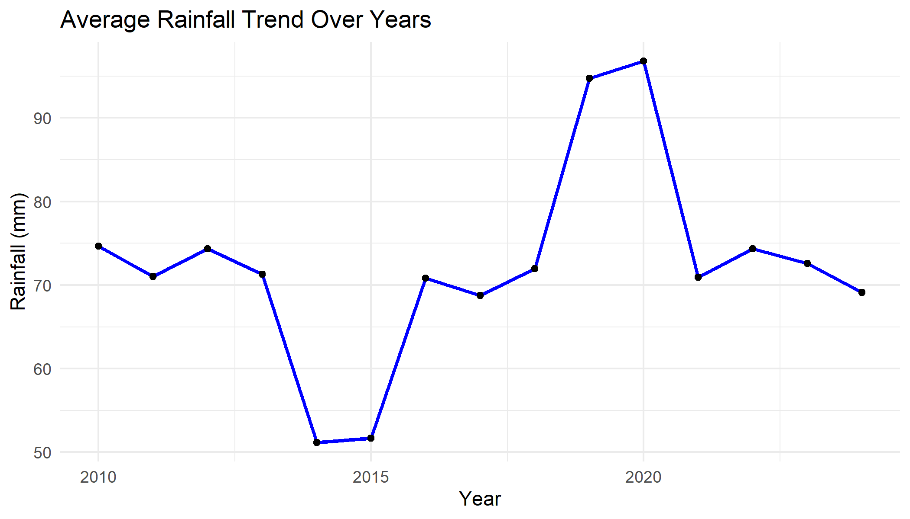
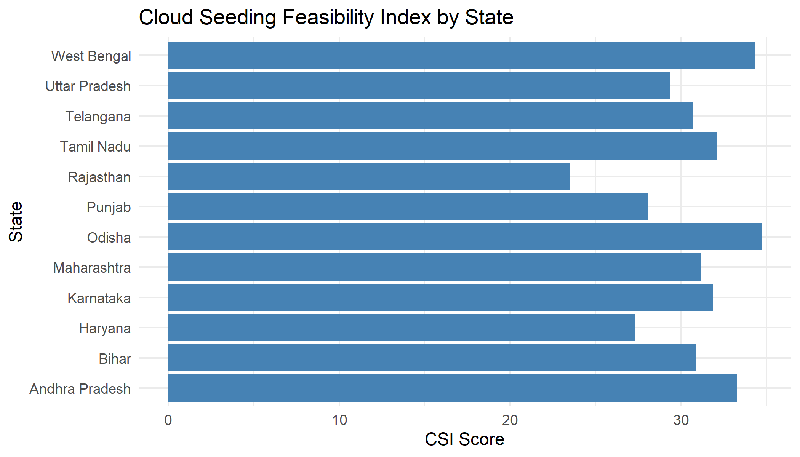
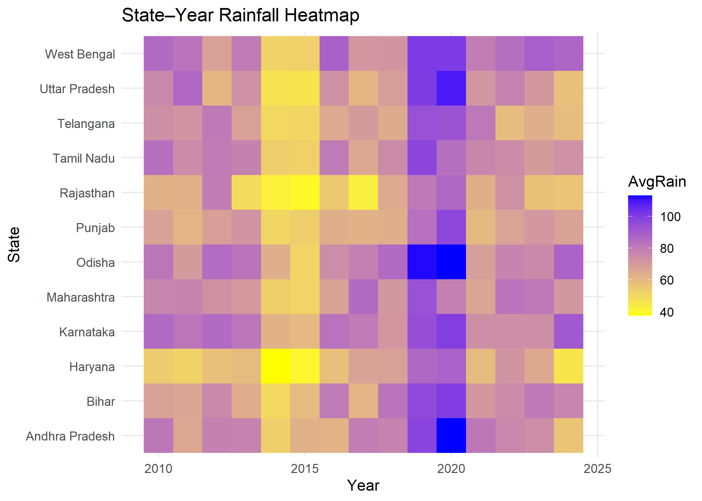
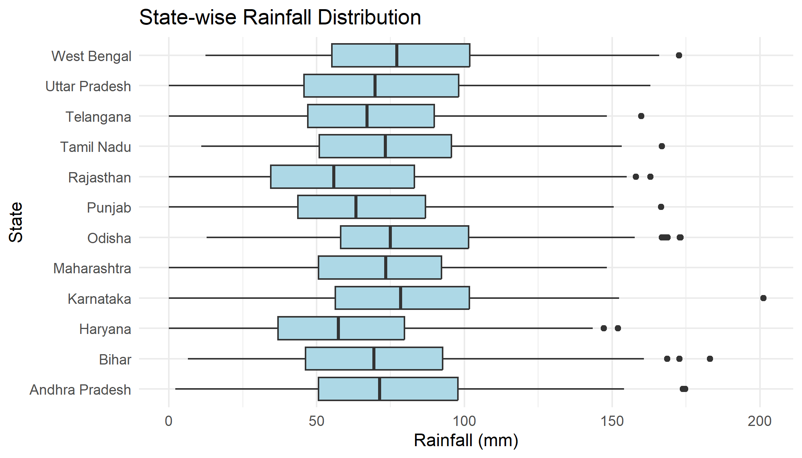

# 🌧️ Cloud Seeding & Climate Analytics
## Interactive Climate Intelligence using R Shiny & Power BI

---

## 🚀 Live Interactive Dashboard (R Shiny)

[Website](https://cloud-seeding-analysis.shinyapps.io/Project2/)

An interactive decision-support dashboard for analyzing rainfall patterns and cloud seeding feasibility across Indian states.

---

## 🧠 Motivation

Climate change has made rainfall patterns increasingly erratic and unpredictable, impacting agriculture, water security, and disaster preparedness.
Cloud seeding is a proposed weather-modification technique, but its feasibility depends strongly on local atmospheric conditions.

This project applies data analytics and visualization to identify regions and periods where cloud seeding could be most effective.

---

## 📊 Project Objectives

- Analyze multi-year climate data across Indian states
- Identify rainfall trends and anomalies
- Compute a Cloud Seeding Feasibility Index (CSI)
- Visualize spatiotemporal climate patterns
- Deliver insights via interactive dashboards

---

## 🌱 Cloud Seeding Feasibility Index (CSI)

CSI = 0.4 × Humidity + 0.4 × Cloud Cover − 0.2 × Rainfall

Higher CSI values indicate better suitability for cloud seeding.

---

## 🖥️ Dashboards Included

### R Shiny Dashboard
- State, Year, and Season filters
- Rainfall trend analysis
- State-wise CSI ranking
- State × Year rainfall heatmap
- Multivariate correlation analysis

Screenshots:

### Power BI Dashboard
- KPI cards (Rainfall, CSI, Humidity)
- State-wise rainfall comparison
- Trend analysis across years
- Scatter plots and heatmaps
- Interactive slicers and tooltips

Screenshot:
- screenshots/state_rainfall_boxplot.png

---

---

## 🛠️ Tech Stack

- R (dplyr, tidyr, ggplot2, GGally)
- Shiny & shinydashboard
- Power BI
- Git & GitHub

---

## 🔍 Key Insights

- Certain states consistently show high CSI values, indicating strong cloud seeding potential.
- Rainfall variability has increased in recent years across multiple regions.
- Cloud cover and humidity correlate more strongly with rainfall than temperature.
- Heatmaps reveal persistent wet and dry zones across time.

---

## ▶️ How to Run Locally

R Shiny:
Set working directory to shiny-dashboard and run shiny::runApp()

Power BI:
Open cloud_seeding_dashboard.pbix in Power BI Desktop.

---

## ⚠️ Notes & Limitations

- Dataset used is synthetic and intended for academic analysis.
- CSI is a heuristic index and can be refined with meteorological validation.
- Real-world cloud seeding outcomes are not modeled.

---

## 🔮 Future Work

- India choropleth rainfall and CSI maps
- Integration with real IMD / NOAA datasets
- Machine learning–based rainfall prediction
- CSI optimization using historical seeding data

---

## 👤 Author

Rishav Shah
Engineering Student | Data Analytics | Climate & Sustainability
GitHub: https://github.com/rishavafk
